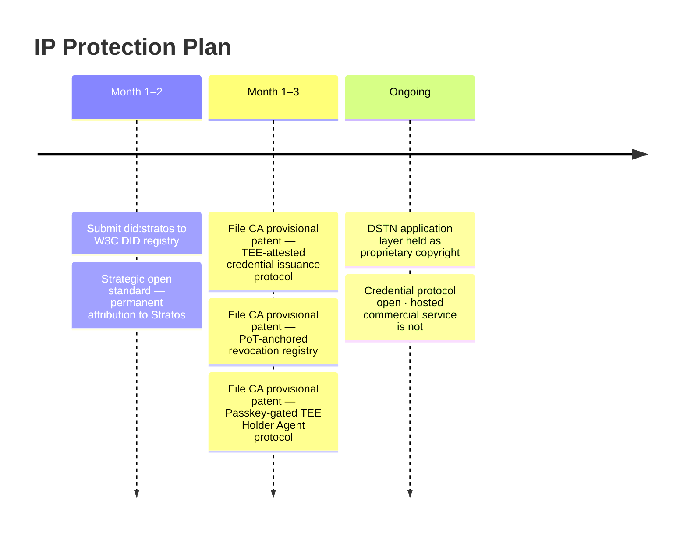
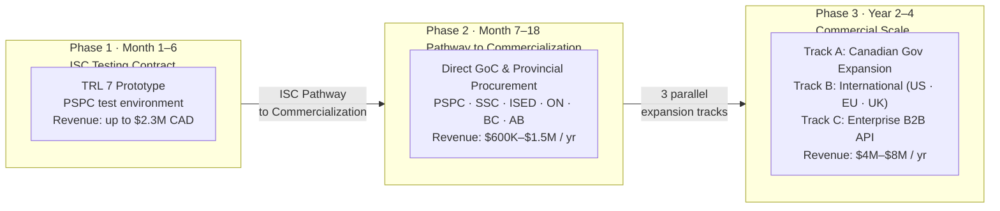
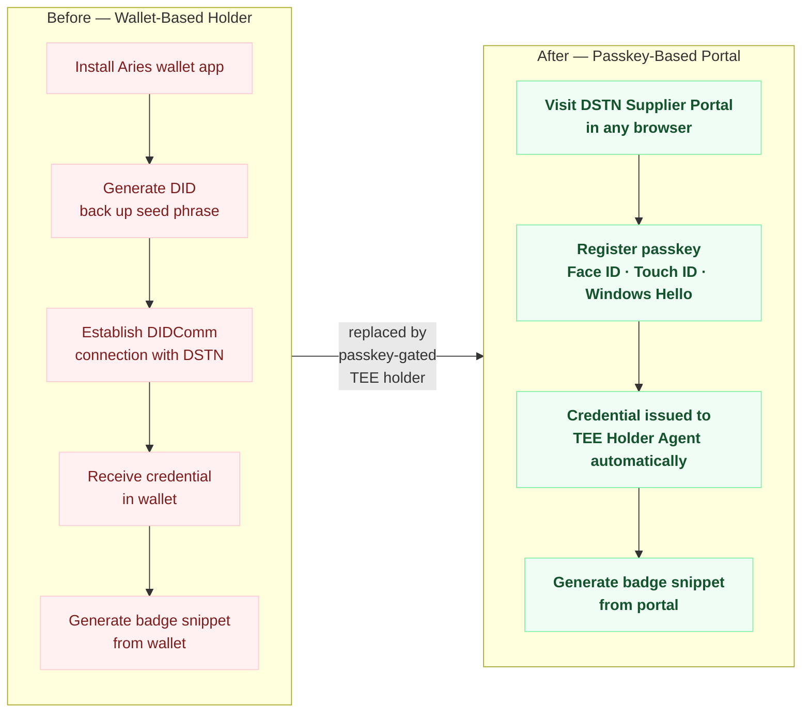
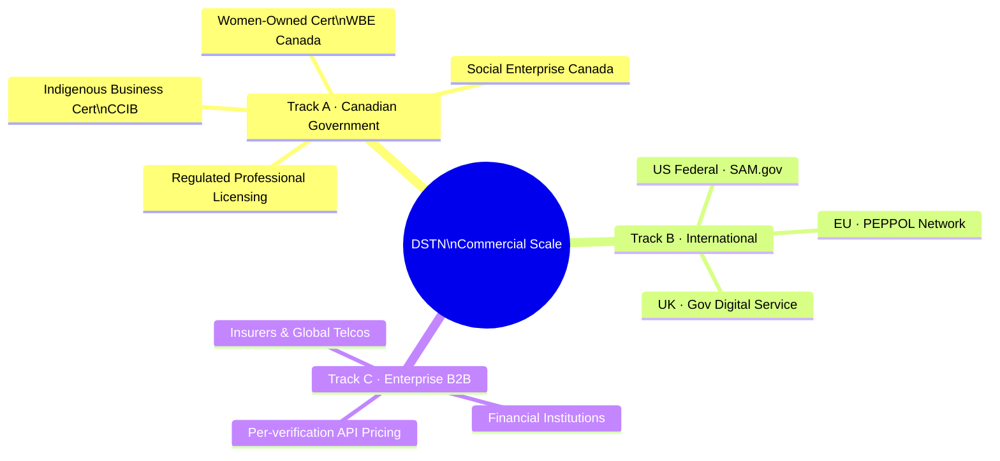
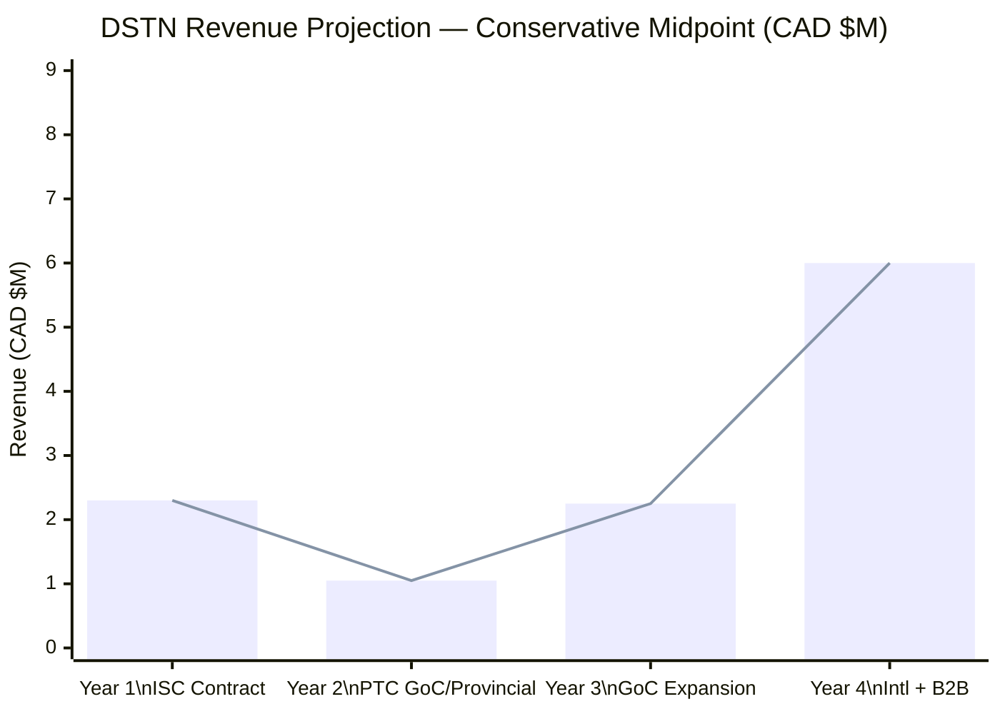
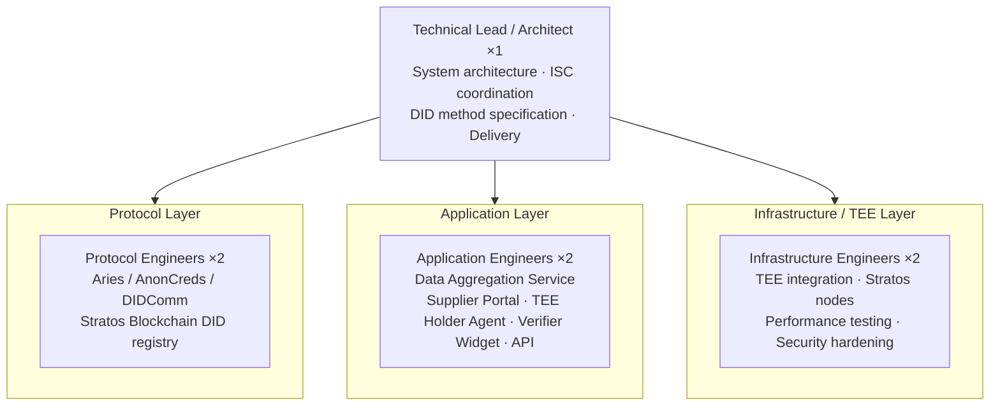
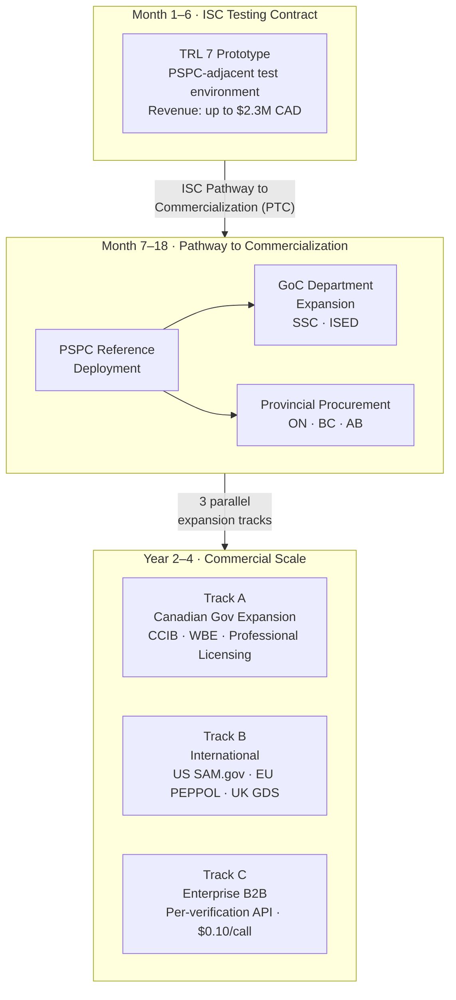

# DSTN Business Plan — Decentralized Supplier Trust Network
**Innovative Solutions Canada — Trust and Verification in Digital Government**
**Prepared by:** Stratos / DEC Foundation
**Date:** 2026-06-11
**Document type:** Business Plan

---

## 1. Executive Summary

Stratos / DEC Foundation proposes DSTN — a Decentralized Supplier Trust Network — to establish a standardized digital credential for Government of Canada suppliers. DSTN automatically aggregates publicly available GoC contract data (CanadaBuys Contract History, Open Government procurement datasets, and the future authoritative public data source once established), derives supplier status from that data, and issues tamper-resistant, cryptographically verifiable credentials to suppliers via a passkey-authenticated web portal — requiring no wallet software, no app installation, and no seed phrase — with no manual government staff action required per credential. Built on Stratos's production-grade decentralized cloud infrastructure and the Hyperledger Aries / AnonCreds open credential protocol, DSTN enables real-time, self-service verification of supplier status at scale.

The ISC Testing Stream contract funds the prototype phase. The commercialization path leads from direct GoC department adoption under the Pathway to Commercialization program to provincial governments, international procurement bodies, and enterprise B2B markets — an addressable market in the hundreds of millions of dollars annually.

---

## 2. Company Profile

**Legal entity:** Stratos / DEC Foundation
**Location:** Montreal, Quebec, Canada
**Canadian content:** 80%+ (goods and services)
**Canadian employees:** 50%+ full-time employees, annual wages, and senior executives based in Canada
**IP ownership:** All proposed innovation IP is owned by Stratos / DEC Foundation; no third-party IP encumbrances on the novel components

**Existing infrastructure:** Stratos operates a production decentralized cloud network (Dcloud) — including blockchain, storage, computing (TEE-capable), and database layers — used by Web3 developers globally. This production-grade infrastructure is the foundation for DSTN and represents a significant existing technology investment that reduces execution risk.

---

## 3. IP Strategy (PS2)

### 3.1 IP Ownership Map

| Asset | Type | Ownership | Status |
|---|---|---|---|
| Stratos Dcloud infrastructure (blockchain, storage, compute, database) | Trade secret + open-source dual | Stratos / DEC Foundation | Existing |
| Proof-of-Traffic consensus mechanism | Trade secret / patent candidate | Stratos / DEC Foundation | Existing |
| `did:stratos` DID method specification | Open standard (W3C submission) | Stratos / DEC Foundation | New — created under this contract |
| TEE-backed credential issuance protocol | Patentable process | Stratos / DEC Foundation | New — created under this contract |
| Decentralized revocation registry on PoT network | Patentable method | Stratos / DEC Foundation | New — created under this contract |
| Passkey-gated TEE Holder Agent protocol | Patentable process | Stratos / DEC Foundation | New — created under this contract |
| DSTN application layer (Supplier Portal, Verifier Widget, Verification API) | Copyright + trade secret | Stratos / DEC Foundation | New — created under this contract |

### 3.2 Third-Party IP Used

| Component | License | Risk |
|---|---|---|
| Hyperledger Aries / AnonCreds | Apache 2.0 | None — no restrictions on commercial or government use |
| W3C VC Data Model | W3C Royalty-Free | None — using the standard creates no IP encumbrance |
| TEE hardware interfaces (Intel SGX / AMD SEV) | Standard hardware | None — no software IP encumbrance |

### 3.3 Protection Plan

1. **Months 1–3:** File provisional patent applications in Canada for the TEE-attested credential issuance protocol and the Proof-of-Traffic anchored revocation registry. Provisional filing establishes priority dates before any public demonstration.
2. **Months 1–2:** Submit `did:stratos` to the W3C DID specification registry. This is a strategic open standard move — it creates permanent attribution to Stratos, makes DSTN the reference implementation of the method, and raises the switching cost for any future competitor attempting to offer a compatible system.
3. **Months 1–3:** File provisional patent application for the passkey-gated TEE Holder Agent protocol — the first AnonCreds holder implementation where the holder DID is anchored to a platform passkey and the holder agent runs entirely within a TEE.
4. **Ongoing:** DSTN application layer (Supplier Portal, Verification API) is kept as proprietary copyright. The credential protocol is open; the hosted commercial service is not.

**Figure BP-1 — IP Protection Timeline**

---

## 4. Commercialization Strategy (PR2)

**Figure BP-2 — Commercialization Roadmap**

### 4.1 Phase 1 — ISC Testing Contract (Months 1–6)

**Objective:** Deliver TRL 7 functional prototype; establish PSPC as reference customer.

**Deliverables:**
- Functional DSTN prototype operating in a PSPC-adjacent test environment, ingesting Open Government procurement datasets as test data per AMD002
- Automated issuance pipeline: data ingestion → status derivation → credential issuance → passkey-gated TEE Holder Agent delivery, with no per-credential government staff action required
- `did:stratos` DID method submitted to W3C registry
- Supplier Portal (passkey registration and authentication, credential status view, badge snippet generator), Verifier Widget, and Verification API deployed and publicly accessible
- Performance benchmarks: sub-1-second verification, 99.9% uptime over 30-day test period
- Security and privacy assessment report aligned with Treasury Board standards

**Revenue:** ISC contract value (up to $2,300,000 CAD)

**Figure BP-2a — Supplier Onboarding: Before and After**

### 4.2 Phase 2 — Pathway to Commercialization (Months 7–18)

ISC's Pathway to Commercialization (PTC) program enables direct procurement by government departments for up to 3 years following successful testing. DSTN's first commercial customers come through this channel.

**Target buyers in priority order:**

| Department | Rationale |
|---|---|
| PSPC | Primary user embedded in the test phase; lowest sales friction |
| Shared Services Canada | Operates GoC shared digital infrastructure; natural platform owner for a shared credential service |
| ISED | Issues business credentials to Canadian companies; same issuer-holder-verifier pattern |
| Ontario, BC, Alberta procurement bodies | Provincial supplier registries face the same problem as PSPC; no federal procurement vehicle needed |

**Revenue model:** Annual SaaS subscription per department — covers unlimited credential issuances and verifications within that department's scope.

| Department tier | Estimated annual contract |
|---|---|
| Large federal department (PSPC, SSC) | $300,000–$400,000 CAD |
| Mid-size federal department (ISED) | $150,000–$250,000 CAD |
| Provincial procurement body | $200,000–$350,000 CAD |

**Year 2 revenue target:** 3–5 GoC and provincial department contracts → $600,000–$1,500,000 CAD

### 4.3 Phase 3 — Commercial Scale (Years 2–4)

Three parallel expansion tracks:

**Track A — Canadian Government Expansion**

DSTN infrastructure is credential-type-agnostic. The same issuer-holder-verifier architecture supports:
- **Indigenous business certification** (CCIB — Canadian Council for Indigenous Business)
- **Women-owned business certification** (WBE Canada)
- **Social Enterprise Canada** certification
- **Regulated professional licensing** (engineering, healthcare, legal professions)

Each of these has an existing issuing authority, a large holder population, and many verifiers — all underserved by current paper or portal-based processes. DSTN provides the shared infrastructure layer.

**Track B — International Government Procurement**

| Market | Entry point | Why now |
|---|---|---|
| US Federal | SAM.gov supplier verification | Same problem as PSPC; the `did:stratos` DID method and W3C VC standards make the system interoperable without rebuilding |
| European Union | PEPPOL public procurement network | EU is actively moving toward VC-based supplier trust; Stratos's decentralized infrastructure is a strong differentiator given EU data sovereignty requirements |
| United Kingdom | UK Government Digital Service | GDS has been piloting VC-based identity for years; warm market with established procurement pathways for Canadian vendors |

**Track C — Enterprise B2B**

Large enterprises (financial institutions, insurers, global telcos) must verify supplier certifications — ISO 27001, SOC 2, ESG ratings, trade compliance — and face the same centralized bottleneck as PSPC. DSTN's Verification API becomes a B2B credential verification network.

Revenue model shifts to **per-verification API pricing** at scale — analogous to Stripe's per-transaction model. At 1M verifications/year at $0.10/verification: $100,000 ARR per enterprise customer. At 10 enterprise customers: $1M ARR from API alone, with near-zero marginal cost.

**Figure BP-3 — Three Expansion Tracks (Year 2–4)**

### 4.4 Revenue Projections

| Year | Primary channel | Revenue (CAD, conservative) |
|---|---|---|
| Year 1 | ISC contract | $2,300,000 |
| Year 2 | 3–5 GoC / provincial departments via PTC | $600,000–$1,500,000 |
| Year 3 | GoC expansion + 1 provincial + CCIB/WBE | $1,500,000–$3,000,000 |
| Year 4 | International track + enterprise B2B API | $4,000,000–$8,000,000 |

**Figure BP-4 — Revenue Projection (Conservative, CAD)**

### 4.5 Defensible Competitive Moat

The DSTN business compounds with adoption in a way that centralized competitors cannot replicate:

1. **On-chain verification history** — the Proof-of-Traffic trust signal accumulates with every verification. A new entrant starting fresh has no history. Switching costs grow with usage.
2. **`did:stratos` as a W3C standard** — once registered and referenced in government procurement policies, replacing the DID method requires government policy changes, not just a technology swap.
3. **Network effect** — every new issuer (government body) and new verifier (buyer, department) that integrates DSTN increases the value of being a holder. The network becomes more useful as it grows, reinforcing itself.
4. **Stratos infrastructure advantage** — competitors building on centralized cloud (AWS, Azure) face higher unit costs and single-region failure risk. Stratos's own infrastructure gives DSTN a structural cost and resilience advantage.
5. **Wallet-free holder experience** — DSTN is the only supplier credential system that requires no wallet installation or seed phrase management. Suppliers authenticate with Face ID, Touch ID, or Windows Hello. Competitors offering wallet-based alternatives face higher onboarding friction and slower supplier adoption — a structural UX moat that compounds with each department deployment.

---

## 5. Equity, Diversity and Inclusion (PR1)

> **Evaluator note:** ISC PR1 evaluates the Offeror's *internal* EDI practices — not the innovation's impact on end users. This section addresses all four PR1 elements: (1) anti-discrimination policies, (2) recruitment strategy, (3) D&I training, and (4) D&I-informed supplier selection. The product's social impact on underrepresented suppliers is addressed separately in Section 4.

### 5.1 Anti-Discrimination Policy

Stratos / DEC Foundation maintains a written workplace anti-discrimination policy that prohibits discrimination on the basis of race, national or ethnic origin, colour, religion, age, sex, sexual orientation, gender identity or expression, marital status, family status, or disability — in alignment with the Canadian Human Rights Act. The policy covers hiring, compensation, promotion, performance evaluation, and termination. It applies to all employees and contractors.

**[Note to team: attach or reference the actual policy document in the ISC-WP submission.]**

### 5.2 Recruitment Strategy

Stratos / DEC Foundation's recruitment strategy actively reduces barriers for candidates from underrepresented groups:

- **Job postings** are distributed through channels that reach Indigenous professionals, women in technology, and persons with disabilities — including Technation's Diversity in Tech initiative, Indigenous Works, and provincial equity-in-tech programs
- **Blind resume review** is applied at the initial screening stage to reduce name-based and credential-source bias
- **Internship and co-op pipeline** with Montreal-area universities with high enrolment from underrepresented groups (Concordia, UQAM) prioritizes candidates from first-generation and equity-deserving backgrounds
- **Interview process** is structured with standardized rubrics to reduce evaluator subjectivity

**[Note to team: confirm which specific channels and programs are actively used; add any existing statistics on team composition if available.]**

### 5.3 Diversity and Inclusion Training

All Stratos / DEC Foundation employees complete D&I training that includes:

- **Unconscious bias awareness** — required at onboarding; annual refresher
- **Inclusive leadership** — mandatory for all team leads and hiring managers, covering equitable evaluation practices
- **Respectful workplace conduct** — covering harassment, accommodation, and reporting procedures in line with Canadian legal requirements

Training resources are sourced from recognized Canadian providers (e.g., Canadian Centre for Diversity and Inclusion) and are tracked for completion as part of annual HR review.

**[Note to team: confirm which specific training programs are in use; note completion rates if tracked.]**

### 5.4 Supplier and Vendor Selection

When selecting subcontractors and technology vendors, Stratos / DEC Foundation considers EDI alongside technical and commercial criteria:

- **Vendor shortlisting** gives preference, all else equal, to vendors that are Indigenous-owned, women-owned, or are certified as diverse suppliers under recognized Canadian programs (e.g., WBE Canada, CCIB)
- **Subcontractor vetting** for this ISC engagement will explicitly apply this criterion — any professional services or infrastructure subcontracts will solicit bids from diverse suppliers before awarding solely to non-diverse vendors
- **Open-source first** preference in tool selection naturally favors community-built alternatives over large incumbent vendors, reducing concentration of spend in non-diverse technology conglomerates

**[Note to team: if Stratos has existing diverse vendor relationships, list them here. Even one concrete example strengthens this section significantly.]**

---

### 5.5 Social Impact of the Innovation (SC4 context)

*The following is relevant to the scope / outcomes evaluation (SC4) rather than PR1, but is included here for completeness:*

DSTN reduces administrative barriers for the 45,000+ Indigenous-owned businesses and 15,000+ women-owned businesses seeking federal procurement access under PSIB and similar programs. Automated credential issuance eliminates the verification wait that currently delays bidding eligibility for businesses without dedicated procurement compliance staff. The Supplier Portal is WCAG 2.1 AA compliant, bilingual, and low-bandwidth optimized. Passkey-based authentication (Face ID, Touch ID, Windows Hello, or a hardware key) eliminates the need to install wallet software or manage a cryptographic seed phrase — substantially reducing the technical barrier for small businesses and suppliers in remote or rural communities with limited IT support. The DSTN infrastructure also supports future credentials for Indigenous Business Certification (CCIB), Women-Owned Business Certification (WBE Canada), and other equity-certifying bodies, making it shared equity infrastructure rather than a single-use procurement tool.

---

## 6. Team

| Role | Responsibilities |
|---|---|
| Technical Lead / Architect | System architecture, ISC coordination, DID method specification, overall delivery |
| Protocol Engineers (×2) | Aries / AnonCreds integration, Stratos Blockchain DID registry, DIDComm implementation |
| Application Engineers (×2) | Data Aggregation Service, Supplier Portal, TEE Holder Agent, Verifier Widget, Verification API |
| Infrastructure / TEE Engineers (×2) | TEE integration, Stratos node configuration, performance testing, security hardening |

All team members are full-time employees based in Canada, meeting ISC's 50%+ Canadian staffing requirement.

**Figure BP-5 — Team Structure**

---

## 7. Go-to-Market Summary

**Figure BP-6 — Go-to-Market Flowchart**

---

*End of Business Plan*
