# DSTN Technical Proposal — Decentralized Supplier Trust Network
**Innovative Solutions Canada — Trust and Verification in Digital Government**
**Prepared by:** Stratos / DEC Foundation
**Date:** 2026-06-11 (revised 2026-06-12 — passkey-gated holder design integrated)
**Document type:** Technical Proposal

---

## 1. Problem Statement

The Government of Canada has no standardized digital mechanism for suppliers to prove — or for buyers to verify — that a company is a verified recipient of federal contract awards in good standing. Today's verification relies on manual lookup across fragmented systems (CanadaBuys contract history, Open Government procurement datasets, departmental records), creating:

- No portable, tamper-resistant credential that a supplier can display anywhere
- No machine-readable API that buyers or GoC departments can call to confirm supplier status in real-time
- Fragmented data across multiple public sources with no single aggregated view
- No cryptographic proof of the status claim — verification requires human judgment, not code
- No usable holder experience for non-technical suppliers — digital wallet adoption requires seed phrase management and app installation that creates unnecessary friction for government procurement users

**Per ISC Amendment 002:** "Government of Canada supplier" status means a supplier is a recipient of a federal contract award and is in good standing. The authoritative public data source for this status does not yet exist in final form; during the testing phase, Open Government procurement datasets serve as the evidence base.

The solution must aggregate publicly available GoC contract data, derive supplier status from that data, and issue a tamper-resistant, cryptographically verifiable credential — one that suppliers carry portably and that any verifier can check instantly with no government staff involvement.

---

## 2. Proposed Solution

**Decentralized Supplier Trust Network (DSTN)** is a three-layer system that:

1. **Ingests and aggregates** publicly available GoC contract data (CanadaBuys Contract History, Open Government procurement datasets, and the future authoritative public source once established) to derive supplier status automatically — no manual government staff action required per credential
2. **Issues tamper-resistant** W3C-aligned supplier credentials anchored on the Stratos decentralized blockchain via the Hyperledger Aries / AnonCreds protocol
3. **Delivers credentials** to a server-side TEE Holder Agent, accessed by suppliers through a web portal authenticated with a platform passkey (Apple Face ID / Touch ID, Google Passkey, Windows Hello, or YubiKey) — no wallet software installed, no seed phrase managed
4. **Exposes real-time verification** through an embeddable widget and public REST API — "single click or scan"

DSTN is built on **Stratos Dcloud** — a production-grade decentralized cloud infrastructure with no central point of failure — combined with the **Hyperledger Aries / AnonCreds** open credential protocol stack.

---

## 3. Architecture

**Figure 1 — Layer Architecture Overview**

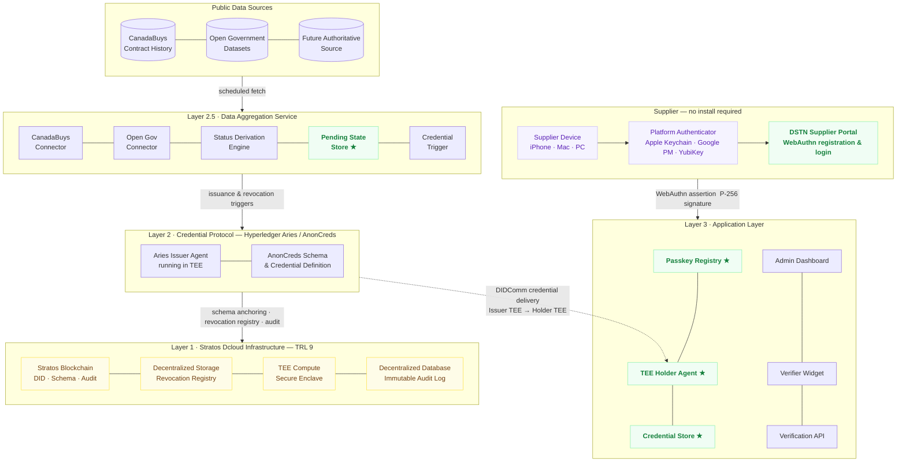

> **Legend:** **green** = new component ★ · **purple** = supplier device / authenticator · **yellow** = Stratos infrastructure · white = unchanged

---

### 3.1 Three-Layer Architecture

**Layer 1 — Stratos Dcloud Infrastructure (existing, TRL 9)**

| Component | Role in DSTN |
|---|---|
| Stratos Blockchain | DID registry (`did:stratos`), AnonCreds schema and credential definition anchoring, tamper-resistant audit chain |
| Decentralized Storage | Credential schemas, AnonCreds revocation registries — no central server |
| Decentralized Compute (TEE) | Secure credential issuance and holder agent operation — private signing keys never leave the hardware enclave |
| Decentralized Database | Immutable, append-only audit log of all issuance, verification, and revocation events |

**Layer 2 — Credential Protocol Layer (new build)**

- **Aries Issuer Agent** — runs inside Stratos TEE; handles AnonCreds credential issuance and revocation on behalf of PSPC
- **AnonCreds Schema + Credential Definition** — anchored on Stratos Blockchain (replacing Hyperledger Indy as the ledger)
- **Revocation Registry** — stored on Stratos Decentralized Storage, updated in real-time

**Layer 2.5 — Data Aggregation Service (new build)**

A scheduled ingestion pipeline that reads all publicly available GoC contract data and maintains a normalized supplier status store:

| Component | Description |
|---|---|
| CanadaBuys Connector | Reads CanadaBuys Contract History via public API / feed; extracts contract award records |
| Open Government Connector | Downloads and parses Open Government procurement datasets (proactive disclosure, contract search) |
| Future Authority Connector | Pluggable adapter reserved for the yet-to-be-determined authoritative public data source (per AMD002) |
| Status Derivation Engine | Aggregates records across sources, applies status logic (contract awarded + in good standing), and flags changes |
| Pending State Store | Holds suppliers detected in the data but not yet registered at the DSTN portal; credential issuance is deferred until registration completes |
| Credential Trigger | Calls the Aries Issuer Agent to issue or revoke credentials when supplier status changes and a passkey registration exists |

**Layer 3 — Application Layer (new build)**

| Component | Description |
|---|---|
| DSTN Supplier Portal | Web application — no install required. Passkey registration and authentication, credential status view, embeddable badge snippet generator |
| Passkey Registry | TEE-resident mapping of passkey P-256 public key → CRA business number → `did:key`. Created once at registration. |
| TEE Holder Agent | Per-supplier Aries holder protocol stack running inside Stratos TEE. Session-scoped: activates on valid passkey assertion, deactivates and clears key material at session end |
| Credential Store | AnonCreds credentials and link secrets encrypted at rest inside TEE, keyed by `did:key` |
| Admin Dashboard | Internal monitoring interface showing data sync status, issuance history, and revocation log |
| Verifier Widget | Single embeddable `<script>` tag — renders a live trust badge on any supplier webpage |
| Verification API | Public REST endpoint returning real-time valid / revoked / expired status with cryptographic proof |

**Holder DID format:** Each supplier's holder DID is derived deterministically from their passkey's P-256 public key using the W3C `did:key` method:

```
did:key:z<multibase-encoded P-256 public key>
```

No blockchain transaction is required to register the supplier's holder DID. The DID is stable as long as the passkey is stable. If a passkey is lost or rotated, the supplier re-registers and DSTN automatically re-issues (issuance is data-driven).

**Figure 2 — System Architecture and Component Diagram**

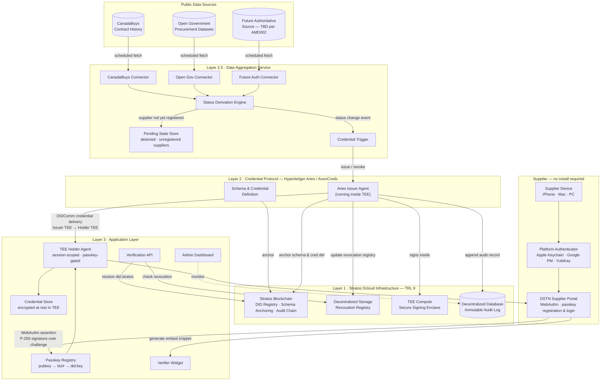

### 3.2 System Actors

**Figure 3 — Actor and Component Relationships**

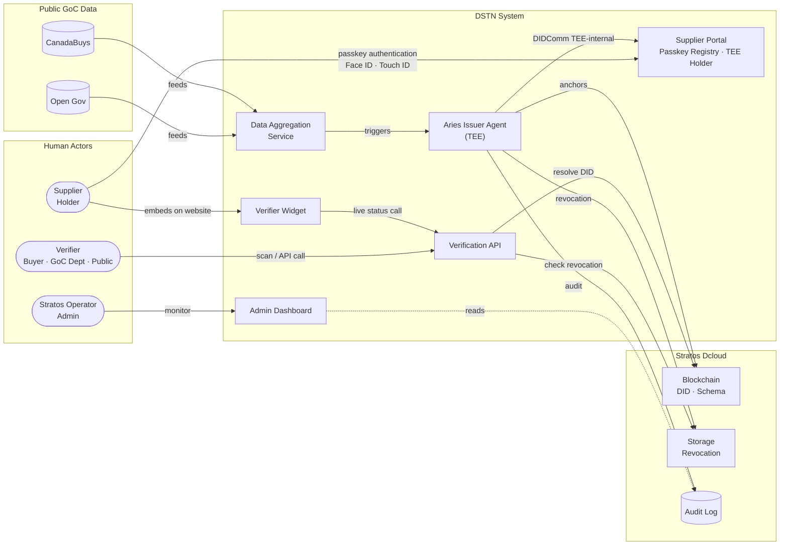

### 3.3 Holder Design Decisions

| Decision | Choice | Rationale |
|---|---|---|
| Holder architecture | Passkey P-256 public key anchors supplier DID | Non-custodial identity — DID is a deterministic function of the passkey; server cannot forge or reassign it |
| DID format | `did:key` from passkey P-256 public key | No on-chain transaction required for supplier DID registration; stable while passkey is stable |
| Credential storage | Server-side TEE (encrypted at rest) | Supplier can access from any device; no data lost on device change; re-issuance is automatic |
| Onboarding — Phase 1 | Self-serve portal | Supplier visits portal, enters business number, registers passkey; no email dependency |
| Onboarding — Phase 2 | Email invite + self-serve fallback | Proactive invite when contact email is available in procurement records |
| Access per company | Single designated holder (Phase 1) | One passkey per company; multi-holder and access delegation deferred to Phase 2 |

**Figure 4 — Component Changes: Removed · Added · Unchanged**

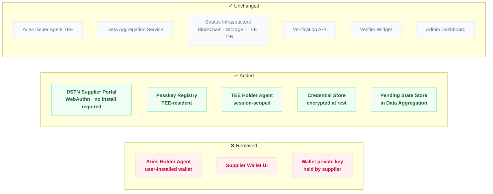

---

## 4. Data Flows

### Flow 1 — Credential Issuance (Automated)

1. Data Aggregation Service fetches CanadaBuys Contract History and Open Government procurement datasets on a scheduled basis
2. Status Derivation Engine applies status logic: if a business number appears as a contract awardee and no adverse standing record exists, supplier status is set to "active"
3. If the supplier has a registered passkey: Credential Trigger invokes the Aries Issuer Agent immediately
4. If the supplier has **no** registered passkey: supplier is recorded in the Pending State Store; issuance is deferred until the supplier registers at the portal
5. Aries Issuer Agent (running inside Stratos TEE) signs an AnonCreds credential — private key never leaves the secure enclave
6. Signed credential delivered to the TEE Holder Agent via internal DIDComm (Issuer TEE to Holder TEE — no external network hop)
7. TEE Holder Agent stores the credential in the Credential Store (encrypted at rest)
8. Credential definition and schema (anchored on Stratos Blockchain) serve as the public verification anchor
9. Issuance event written to Stratos Decentralized Database as an immutable audit record

**No government staff action is required per individual credential.** The pipeline is data-event-driven, not human-initiated.

**Figure 5 — Credential Issuance Sequence**

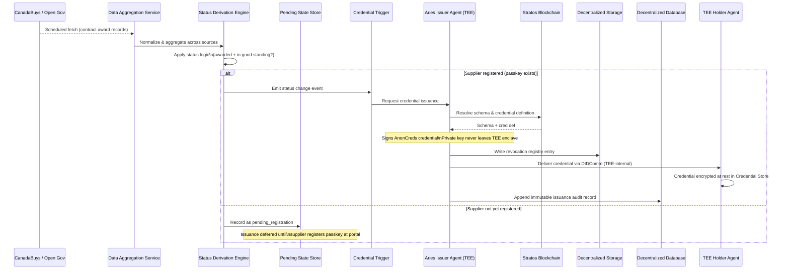

### Flow 2 — Supplier Registration (Self-Serve)

Suppliers visit the DSTN portal once to register their passkey and claim their credential. No wallet software is installed. No seed phrase is generated.

**Figure 6 — Supplier Registration Sequence**

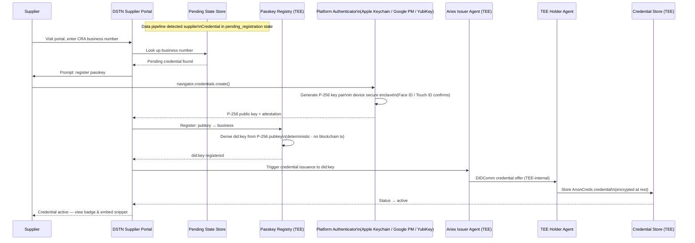

### Flow 3 — Supplier Session (Returning Access)

On every subsequent visit, the supplier authenticates with their passkey. No password, no username.

**Figure 7 — Supplier Session Sequence**

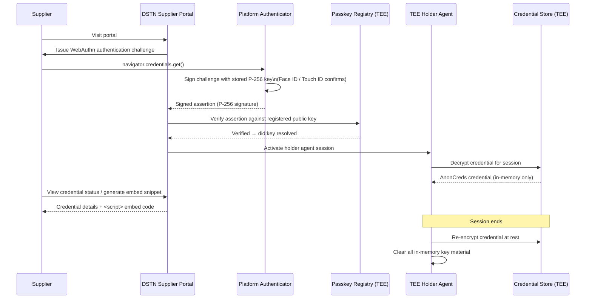

### Flow 4 — Credential Display (Embeddable Badge)

1. Supplier logs into the portal (passkey authentication) and generates a Verifier Widget snippet
2. Supplier pastes the `<script>` tag into their website — no technical knowledge required
3. Widget renders a live trust badge and calls the Verification API on every page load
4. Badge shows real-time status: green (verified), amber (expiring soon), red (revoked / expired)
5. No polling lag — the API reads directly from Stratos chain state

**Figure 8 — Credential Display (Embeddable Badge) Sequence**

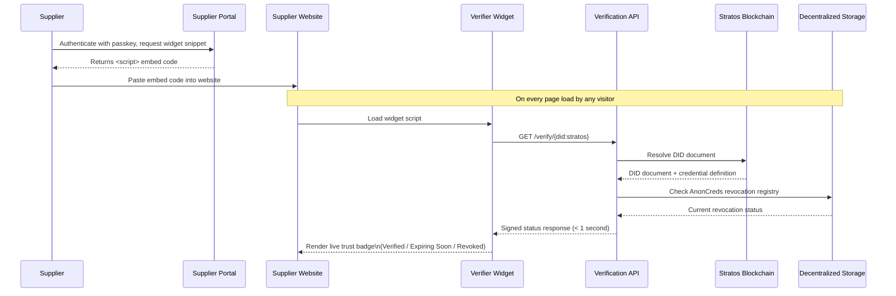

### Flow 5 — Active Verification

1. A buyer or GoC department scans the QR code or calls the Verification API directly
2. API resolves the supplier's `did:stratos` DID against the Stratos Blockchain
3. API checks the revocation registry on Stratos Decentralized Storage in real-time
4. Returns a signed JSON response: credential status, issuing authority, issue date, expiry, and cryptographic proof
5. Round-trip completes in under one second

**Figure 9 — Active Verification Sequence**

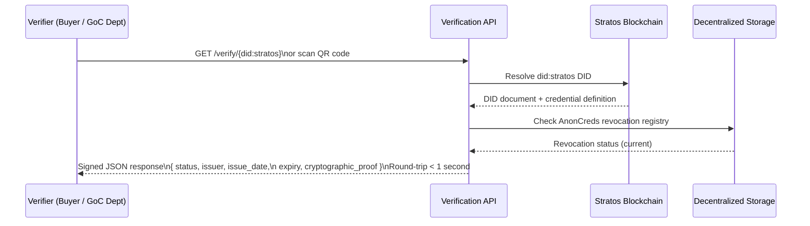

### Flow 6 — Revocation (Automated)

1. Data Aggregation Service detects that a supplier's status has changed in the public data (contract no longer in good standing, business deregistered, adverse record added)
2. Status Derivation Engine sets the supplier status to "revoked"
3. Credential Trigger calls the Aries Issuer Agent to update the AnonCreds revocation registry on Stratos Decentralized Storage
4. Change propagates across the Stratos network within seconds
5. Next call to the Verification API returns "revoked" — badge on the supplier's website updates automatically
6. Revocation event appended to the immutable audit log in Stratos Decentralized Database

**Revocation is data-driven**, not staff-driven. Any change in the authoritative public data propagates to the credential within the next scheduled data sync window.

**Figure 10 — Automated Revocation Sequence**

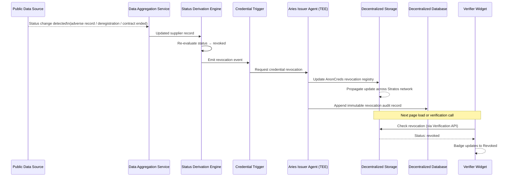

---

## 5. Technical Innovation (State-of-Art Advancement)

### Innovation 1 — First Permissionless Decentralized Ledger for AnonCreds Anchoring

Every existing Hyperledger Aries deployment in the world — including BC Government's production system — uses **Hyperledger Indy** as the anchoring ledger. Indy is permissioned, run by a consortium of steward nodes, and carries centralization risks: a small set of operators controls the network.

DSTN replaces Indy with the Stratos Blockchain — a fully permissionless, incentivized network governed by Proof-of-Traffic consensus. This is the first deployment of AnonCreds-standard verifiable credentials on a public decentralized chain with no steward cartel. The `did:stratos` DID method will be submitted to the W3C DID registry as a new formally specified method.

**Claim:** First W3C-registered DID method backed by a Proof-of-Traffic incentivized network.

### Innovation 2 — TEE-Attested Credential Issuance

In standard Aries deployments, the issuer's private signing key resides in a software wallet on a server. A compromised server means an attacker can issue fraudulent credentials indefinitely and undetectably.

In DSTN, the Aries Issuer Agent runs inside Stratos's Trusted Execution Environment (hardware-isolated secure enclave — Intel SGX / AMD SEV). The private key is generated inside the TEE and never exported. Every credential issuance produces a hardware attestation — a cryptographic proof that signing occurred in a trusted enclave. Verifiers can check this attestation alongside the credential proof itself.

**Claim:** First VC issuance system with hardware-level attestation proving the signing key was never exposed to software.

### Innovation 3 — Decentralized Revocation with No Central Revocation Server

The dominant revocation approaches (OCSP, CRL, W3C StatusList2021) all require a highly-available central server. If that server goes down, verifiers either reject all credentials as unverifiable or silently skip the revocation check — both outcomes are unacceptable for government procurement.

DSTN stores the AnonCreds revocation registry on Stratos Decentralized Storage, replicated across the Stratos resource network with no single point of failure. Revocation updates propagate via the same Proof-of-Traffic mechanism governing all Stratos network traffic. There is no revocation server to attack, take offline, or misconfigure.

**Claim:** First zero-downtime decentralized revocation registry for AnonCreds credentials.

### Innovation 4 — Proof-of-Traffic as an On-Chain Trust Signal

Stratos's Proof-of-Traffic consensus measures actual network resource usage by each participant node. DSTN extends this mechanism: the volume of real verification calls against a supplier's credential becomes a measurable, on-chain trust signal. A credential that has been independently verified 10,000 times carries demonstrably more usage evidence than one that has never been queried — and this signal is network-observed, not self-asserted or issuer-asserted.

**Claim:** First credential system where verification traffic itself is an on-chain, auditable trust metric.

### Innovation 5 — Passkey-Anchored Holder Identity with Zero Wallet UX

The industry standard for VC holder agents requires the holder to install a wallet application, generate or import a DID private key, and manage a cryptographic seed phrase — significant friction for non-technical government procurement users.

DSTN eliminates this barrier: the supplier's device passkey (W3C WebAuthn P-256 credential, stored in the Apple Secure Enclave, Google Titan chip, or a FIDO2 hardware key) serves as the identity anchor. The supplier's holder DID is derived deterministically from the passkey's P-256 public key using the `did:key` method — no blockchain transaction, no app install, no seed phrase. A TEE Holder Agent running on Stratos infrastructure activates only during passkey-authenticated sessions and encrypts all credential material at rest under TEE hardware isolation.

The non-custodial property is precise: the supplier's *identity DID* is genuinely non-custodial — it is a mathematical function of the passkey private key, which never leaves the supplier's device secure enclave. The credential bytes are TEE-custodial, under the same hardware-isolation guarantee as the Aries Issuer Agent (Innovation 2).

**Claim:** First AnonCreds holder implementation where the holder's DID is anchored to a platform passkey and the holder agent runs entirely in a TEE — achieving wallet-free UX without sacrificing cryptographic identity integrity.

### Innovation Summary

| Innovation | State-of-art claim |
|---|---|
| `did:stratos` DID method | First permissionless PoT-backed DID registry |
| TEE-attested issuance | Hardware proof no other VC issuer provides |
| Decentralized revocation registry | Eliminates the single point of failure all current systems carry |
| PoT-derived trust score | Entirely novel signal — no prior art in credential systems |
| Passkey-anchored holder identity | First wallet-free AnonCreds holder with TEE-backed passkey gating |

---

## 6. TRL Assessment and Roadmap

### 6.1 TRL at Submission — TRL 7

DSTN integrates two independently TRL-9 technology stacks — Stratos Dcloud and Hyperledger Aries/AnonCreds — in a new government application domain. Integration of mature production technologies is classified as TRL 7 at the point of a demonstrated functional prototype; it does not restart at TRL 1 because the application is new.

**Evidence for TRL 7 at submission:**

| Component | TRL basis | Evidence |
|---|---|---|
| Stratos Blockchain (DID registry, credential anchoring) | TRL 9 | Production mainnet live with commercial traffic |
| Stratos Decentralized Storage (revocation registry) | TRL 9 | Production mainnet live |
| Stratos TEE compute (secure signing and holder agent) | TRL 9 | TEE-capable nodes operating in production |
| Hyperledger Aries / AnonCreds (credential protocol) | TRL 9 | BC Government's OrgBook and Digital Trust production systems are identical open-source stack |
| W3C WebAuthn / FIDO2 (passkey authentication) | TRL 9 | Deployed at scale by Apple, Google, Microsoft; supported natively by all major browsers and OS platforms |
| CanadaBuys / Open Government public data ingestion | TRL 9 | Reading a public REST API or CSV dataset is standard integration practice with no research novelty |
| DSTN end-to-end integration (data → status → credential → TEE holder → passkey-gated portal → verify) | **TRL 7** | Functional prototype demonstrable at submission |

**What the functional prototype demonstrates at submission:**
1. A `did:stratos` DID resolution against the Stratos Blockchain ✓
2. An AnonCreds schema and credential definition anchored on Stratos chain ✓
3. An end-to-end test issuance: data ingestion → status derivation → Aries agent → DIDComm delivery to TEE Holder Agent ✓
4. A WebAuthn passkey registration and authentication flow activating the TEE Holder Agent ✓
5. A verification API call returning signed status response in < 1 second ✓
6. A revocation registry update propagated via Stratos Decentralized Storage ✓

The ISC testing contract funds **hardening this prototype to production quality** in a PSPC-adjacent operational environment — not building from scratch.

### 6.2 Contract Milestone Plan

**Target:** TRL 7 validated in a PSPC-adjacent test environment with formal performance benchmarks

| Period | Milestone | Acceptance criterion |
|---|---|---|
| Month 1–2 | `did:stratos` DID method specification finalized and submitted to W3C registry; Data Aggregation Service ingesting CanadaBuys and Open Government datasets end-to-end; automated issuance pipeline demonstrated with test supplier data; passkey registration flow functional | Credential visible in supplier portal within 60 minutes of data ingestion cycle; passkey authentication activates TEE Holder Agent |
| Month 3–4 | Supplier Portal and Verifier Widget functional; performance benchmarks established; revocation flow demonstrated end-to-end; bilingual UI complete | Sub-1-second verification API response; revocation reflected in widget within 30 seconds of status change |
| Month 5–6 | TEE-attested issuance complete (hardware attestation verifiable); system deployed in PSPC-adjacent test environment; 30-day stability test; security and privacy assessment aligned with Treasury Board standards | 99.9% uptime over 30-day test; hardware attestation verifiable by third-party; security assessment delivered |

**Figure 11 — Contract Milestone Timeline**

```mermaid
gantt
    title DSTN Contract Milestones (6-Month ISC Testing Stream)
    dateFormat MM
    axisFormat Month %m

    section Month 1–2
    did:stratos DID spec → W3C submission          :m1, 01, 2M
    Data Aggregation Service (CanadaBuys + Open Gov):m2, 01, 2M
    Automated issuance pipeline with test data     :m3, 01, 2M
    Passkey registration flow + TEE Holder Agent   :m4, 01, 2M

    section Month 3–4
    Supplier Portal & Verifier Widget              :m5, 03, 2M
    Revocation flow end-to-end                     :m6, 03, 2M
    Performance benchmarks & bilingual UI          :m7, 03, 2M

    section Month 5–6
    TEE-attested issuance (hardware attestation)   :m8, 05, 2M
    PSPC-adjacent test environment deployment      :m9, 05, 2M
    30-day stability run + security assessment     :m10, 05, 2M
```

**Team allocation (5–7 engineers):**

| Role | Headcount |
|---|---|
| Protocol layer (Aries / AnonCreds / Stratos Blockchain integration) | 2 |
| Application layer (Data Aggregation Service, Supplier Portal, TEE Holder Agent, Verifier Widget, API) | 2 |
| Infrastructure / TEE integration (issuer and holder TEE) | 2 |
| Technical lead (architecture, ISC coordination) | 1 |

---

## 7. Risk Assessment and Mitigation

| Risk | Likelihood | Mitigation |
|---|---|---|
| Team learning curve on Aries / AnonCreds | Medium | Aries is Apache 2.0 with extensive documentation and a large open-source community; BCGov's open-source reference implementation accelerates ramp-up |
| TEE hardware availability in test environment | Low | Stratos Dcloud already operates TEE-capable nodes on its production mainnet |
| W3C DID method registration timeline | Low | Registration is self-service via GitHub PR to the W3C DID registry; no approval gate that blocks development |
| Stratos Blockchain throughput under verification load | Low | Mainnet handles production Web3 dApp traffic; credential verification calls are read-heavy and lightweight |
| Authoritative public data source not yet determined (AMD002) | Medium | During testing, Open Government procurement datasets provide sufficient supplier data. The Data Aggregation Service is architected with a pluggable connector layer — the future authoritative source is added as a new connector without changing the credential issuance pipeline |
| CanadaBuys / Open Government API changes or downtime | Low | Connectors implement retry logic and local caching of the last successful sync; credentials remain valid between sync cycles; any data source outage does not affect verification of already-issued credentials |
| Passkey cross-platform sync gaps | Low | Apple Keychain, Google Password Manager, and Windows Hello each sync passkeys across devices within the same ecosystem. For a supplier changing platforms (e.g., Apple to Android), the portal provides a re-registration flow: the supplier enters their business number, registers a new passkey, and DSTN automatically re-issues the credential — no staff involvement, no credential loss |

---

## 8. Standards and Compliance

- **W3C Verifiable Credentials Data Model 2.0** — DSTN credentials conform to the W3C VC standard
- **W3C Decentralized Identifiers (DID) Core 1.0** — `did:stratos` method (issuer) and `did:key` method (holder) formally specified
- **AnonCreds Specification 1.0** — credential format for privacy-preserving issuance
- **Hyperledger Aries RFC protocols** — DIDComm messaging, issue-credential, present-proof
- **W3C Web Authentication (WebAuthn) Level 3** — passkey registration and authentication; P-256 (secp256r1) signature scheme
- **FIDO2 / CTAP2** — platform authenticator protocol (Apple Secure Enclave, Google Titan, YubiKey)
- **WCAG 2.1 AA** — Verifier Widget and Supplier Portal
- **Official Languages Act** — all user-facing interfaces bilingual (English / French)
- **Treasury Board Directive on Privacy** — no personal data stored on-chain; credentials reference opaque identifiers only

---

*End of Technical Proposal*
