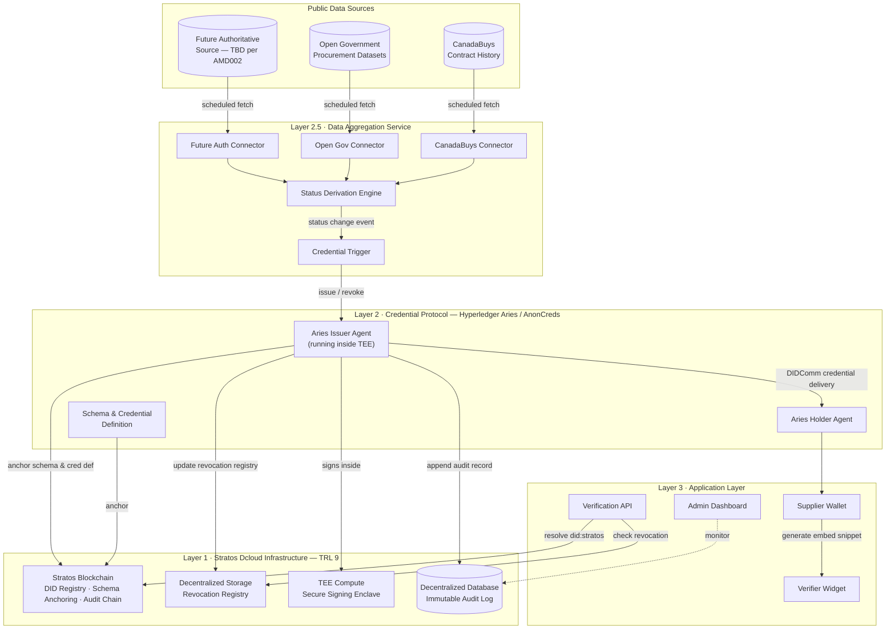
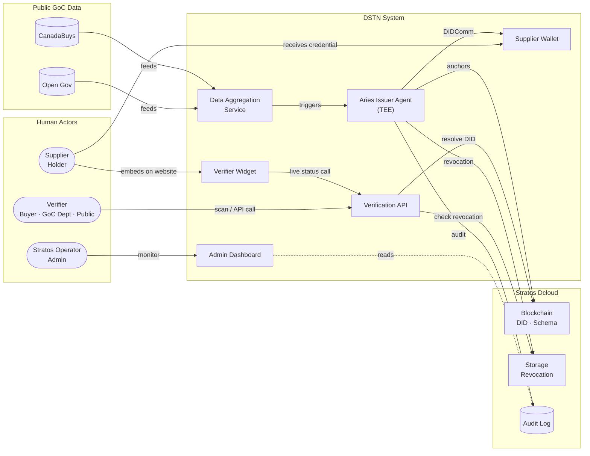
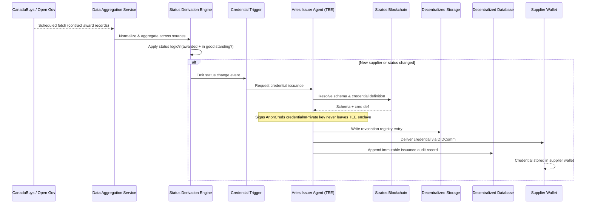
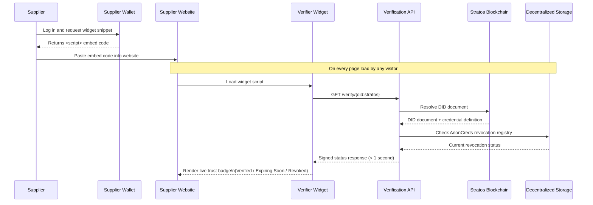
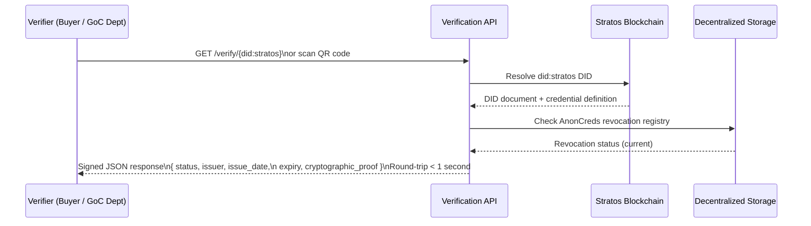
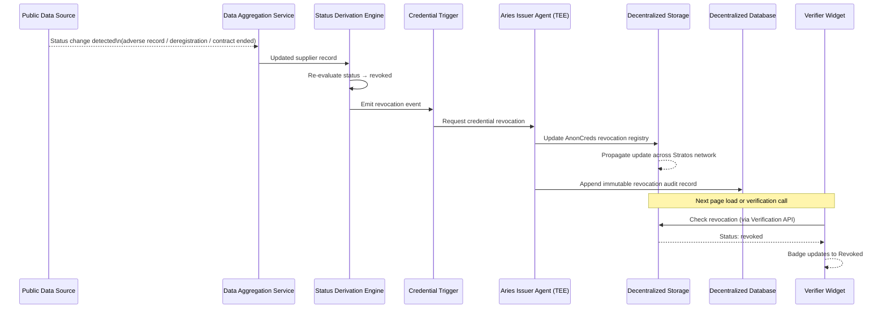

# DSTN Technical Proposal — Decentralized Supplier Trust Network
**Innovative Solutions Canada — Trust and Verification in Digital Government**
**Prepared by:** Stratos / DEC Foundation
**Date:** 2026-06-11
**Document type:** Technical Proposal

---

## 1. Problem Statement

The Government of Canada has no standardized digital mechanism for suppliers to prove — or for buyers to verify — that a company is a verified recipient of federal contract awards in good standing. Today's verification relies on manual lookup across fragmented systems (CanadaBuys contract history, Open Government procurement datasets, departmental records), creating:

- No portable, tamper-resistant credential that a supplier can display anywhere
- No machine-readable API that buyers or GoC departments can call to confirm supplier status in real-time
- Fragmented data across multiple public sources with no single aggregated view
- No cryptographic proof of the status claim — verification requires human judgment, not code

**Per ISC Amendment 002:** "Government of Canada supplier" status means a supplier is a recipient of a federal contract award and is in good standing. The authoritative public data source for this status does not yet exist in final form; during the testing phase, Open Government procurement datasets serve as the evidence base.

The solution must aggregate publicly available GoC contract data, derive supplier status from that data, and issue a tamper-resistant, cryptographically verifiable credential — one that suppliers carry portably and that any verifier can check instantly with no government staff involvement.

---

## 2. Proposed Solution

**Decentralized Supplier Trust Network (DSTN)** is a three-layer system that:

1. **Ingests and aggregates** publicly available GoC contract data (CanadaBuys Contract History, Open Government procurement datasets, and the future authoritative public source once established) to derive supplier status automatically — no manual government staff action required per credential
2. **Issues tamper-resistant** W3C-aligned supplier credentials anchored on the Stratos decentralized blockchain via the Hyperledger Aries / AnonCreds protocol
3. **Delivers credentials** to supplier wallets where they are held portably and displayed anywhere
4. **Exposes real-time verification** through an embeddable widget and public REST API — "single click or scan"

DSTN is built on **Stratos Dcloud** — a production-grade decentralized cloud infrastructure with no central point of failure — combined with the **Hyperledger Aries / AnonCreds** open credential protocol stack.

---

## 3. Architecture

### 3.1 Three-Layer Architecture

**Layer 1 — Stratos Dcloud Infrastructure (existing, TRL 9)**

| Component | Role in DSTN |
|---|---|
| Stratos Blockchain | DID registry (`did:stratos`), AnonCreds schema and credential definition anchoring, tamper-resistant audit chain |
| Decentralized Storage | Credential schemas, AnonCreds revocation registries — no central server |
| Decentralized Compute (TEE) | Secure credential issuance — private signing key never leaves the hardware enclave |
| Decentralized Database | Immutable, append-only audit log of all issuance, verification, and revocation events |

**Layer 2 — Credential Protocol Layer (new build)**

- **Aries Issuer Agent** — runs inside Stratos TEE; handles AnonCreds credential issuance and revocation on behalf of PSPC
- **Aries Holder Agent** — supplier-side wallet for receiving and managing credentials
- **AnonCreds Schema + Credential Definition** — anchored on Stratos Blockchain (replacing Hyperledger Indy as the ledger)
- **Revocation Registry** — stored on Stratos Decentralized Storage, updated in real-time

**Layer 2.5 — Data Aggregation Service (new build)**

A scheduled ingestion pipeline that reads all publicly available GoC contract data and maintains a normalized supplier status store:

| Component | Description |
|---|---|
| CanadaBuys Connector | Reads CanadaBuys Contract History via public API / feed; extracts contract award records |
| Open Government Connector | Downloads and parses Open Government procurement datasets (proactive disclosure, contract search) |
| Future Authority Connector | Pluggable adapter reserved for the yet-to-be-determined authoritative public data source (per AMD002) |
| Status Derivation Engine | Aggregates records across sources, applies status logic (contract awarded + in good standing), and flags changes |
| Credential Trigger | Calls the Aries Issuer Agent to issue or revoke credentials when supplier status changes |

**Layer 3 — Application Layer (new build)**

| Component | Description |
|---|---|
| Admin Dashboard | Internal monitoring interface showing data sync status, issuance history, and revocation log — no manual per-supplier credential issuance required |
| Supplier Wallet | Web and mobile interface for suppliers to receive credentials and generate embeddable badges |
| Verifier Widget | Single embeddable `<script>` tag — renders a live trust badge on any supplier webpage |
| Verification API | Public REST endpoint returning real-time valid / revoked / expired status with cryptographic proof |

**Figure 1 — System Architecture and Component Diagram**

### 3.2 System Actors

**Figure 2 — Actor and Component Relationships**

---

## 4. Data Flows

### Flow 1 — Credential Issuance (Automated)

1. Data Aggregation Service fetches CanadaBuys Contract History and Open Government procurement datasets on a scheduled basis
2. Status Derivation Engine applies status logic: if a business number appears as a contract awardee and no adverse standing record exists, supplier status is set to "active"
3. Credential Trigger invokes the Aries Issuer Agent for new or status-changed suppliers
4. Aries Issuer Agent (running inside Stratos TEE) signs an AnonCreds credential — private key never leaves the secure enclave
5. Signed credential delivered to the Supplier Wallet via DIDComm (Aries connection protocol)
6. Credential definition and schema (anchored on Stratos Blockchain) serve as the public verification anchor
7. Issuance event written to Stratos Decentralized Database as an immutable audit record

**No government staff action is required per individual credential.** The pipeline is data-event-driven, not human-initiated.

**Figure 3 — Credential Issuance Sequence**

### Flow 2 — Credential Display (Embeddable Badge)

1. Supplier logs into their Wallet and generates a Verifier Widget snippet
2. Supplier pastes the `<script>` tag into their website — no technical knowledge required
3. Widget renders a live trust badge and calls the Verification API on every page load
4. Badge shows real-time status: green (verified), amber (expiring soon), red (revoked / expired)
5. No polling lag — the API reads directly from Stratos chain state

**Figure 4 — Credential Display (Embeddable Badge) Sequence**

### Flow 3 — Active Verification

1. A buyer or GoC department scans the QR code or calls the Verification API directly
2. API resolves the supplier's `did:stratos` DID against the Stratos Blockchain
3. API checks the revocation registry on Stratos Decentralized Storage in real-time
4. Returns a signed JSON response: credential status, issuing authority, issue date, expiry, and cryptographic proof
5. Round-trip completes in under one second

**Figure 5 — Active Verification Sequence**

### Flow 4 — Revocation (Automated)

1. Data Aggregation Service detects that a supplier's status has changed in the public data (contract no longer in good standing, business deregistered, adverse record added)
2. Status Derivation Engine sets the supplier status to "revoked"
3. Credential Trigger calls the Aries Issuer Agent to update the AnonCreds revocation registry on Stratos Decentralized Storage
4. Change propagates across the Stratos network within seconds
5. Next call to the Verification API returns "revoked" — badge on the supplier's website updates automatically
6. Revocation event appended to the immutable audit log in Stratos Decentralized Database

**Revocation is data-driven**, not staff-driven. Any change in the authoritative public data propagates to the credential within the next scheduled data sync window.

**Figure 6 — Automated Revocation Sequence**

---

## 5. Technical Innovation (State-of-Art Advancement)

### Innovation 1 — First Permissionless Decentralized Ledger for AnonCreds Anchoring

Every existing Hyperledger Aries deployment in the world — including BC Government's production system — uses **Hyperledger Indy** as the anchoring ledger. Indy is permissioned, run by a consortium of steward nodes, and carries centralization risks: a small set of operators controls the network.

DSTN replaces Indy with the Stratos Blockchain — a fully permissionless, incentivized network governed by Proof-of-Traffic consensus. This is the first deployment of AnonCreds-standard verifiable credentials on a public decentralized chain with no steward cartel. The `did:stratos` DID method will be submitted to the W3C DID registry as a new formally specified method.

**Claim:** First W3C-registered DID method backed by a Proof-of-Traffic incentivized network.

### Innovation 2 — TEE-Attested Credential Issuance

In standard Aries deployments, the issuer's private signing key resides in a software wallet on a server. A compromised server means an attacker can issue fraudulent credentials indefinitely and undetectably.

In DSTN, the Aries Issuer Agent runs inside Stratos's Trusted Execution Environment (hardware-isolated secure enclave — Intel SGX / AMD SEV). The private key is generated inside the TEE and never exported. Every credential issuance produces a hardware attestation — a cryptographic proof that signing occurred in a trusted enclave. Verifiers can check this attestation alongside the credential proof itself.

**Claim:** First VC issuance system with hardware-level attestation proving the signing key was never exposed to software.

### Innovation 3 — Decentralized Revocation with No Central Revocation Server

The dominant revocation approaches (OCSP, CRL, W3C StatusList2021) all require a highly-available central server. If that server goes down, verifiers either reject all credentials as unverifiable or silently skip the revocation check — both outcomes are unacceptable for government procurement.

DSTN stores the AnonCreds revocation registry on Stratos Decentralized Storage, replicated across the Stratos resource network with no single point of failure. Revocation updates propagate via the same Proof-of-Traffic mechanism governing all Stratos network traffic. There is no revocation server to attack, take offline, or misconfigure.

**Claim:** First zero-downtime decentralized revocation registry for AnonCreds credentials.

### Innovation 4 — Proof-of-Traffic as an On-Chain Trust Signal

Stratos's Proof-of-Traffic consensus measures actual network resource usage by each participant node. DSTN extends this mechanism: the volume of real verification calls against a supplier's credential becomes a measurable, on-chain trust signal. A credential that has been independently verified 10,000 times carries demonstrably more usage evidence than one that has never been queried — and this signal is network-observed, not self-asserted or issuer-asserted.

**Claim:** First credential system where verification traffic itself is an on-chain, auditable trust metric.

### Innovation Summary

| Innovation | State-of-art claim |
|---|---|
| `did:stratos` DID method | First permissionless PoT-backed DID registry |
| TEE-attested issuance | Hardware proof no other VC issuer provides |
| Decentralized revocation registry | Eliminates the single point of failure all current systems carry |
| PoT-derived trust score | Entirely novel signal — no prior art in credential systems |

---

## 6. TRL Assessment and Roadmap

### 6.1 TRL at Submission — TRL 7

DSTN integrates two independently TRL-9 technology stacks — Stratos Dcloud and Hyperledger Aries/AnonCreds — in a new government application domain. Integration of mature production technologies is classified as TRL 7 at the point of a demonstrated functional prototype; it does not restart at TRL 1 because the application is new.

**Evidence for TRL 7 at submission:**

| Component | TRL basis | Evidence |
|---|---|---|
| Stratos Blockchain (DID registry, credential anchoring) | TRL 9 | Production mainnet live with commercial traffic |
| Stratos Decentralized Storage (revocation registry) | TRL 9 | Production mainnet live |
| Stratos TEE compute (secure signing) | TRL 9 | TEE-capable nodes operating in production |
| Hyperledger Aries / AnonCreds (credential protocol) | TRL 9 | BC Government's OrgBook and Digital Trust production systems are identical open-source stack |
| CanadaBuys / Open Government public data ingestion | TRL 9 | Reading a public REST API or CSV dataset is standard integration practice with no research novelty |
| DSTN end-to-end integration (data → status → credential → wallet → verify) | **TRL 7** | Functional prototype demonstrable at submission: schema anchored on Stratos chain, test credential issued via DIDComm, verification API returning signed response |

**What the functional prototype demonstrates at submission:**
1. A `did:stratos` DID resolution against the Stratos Blockchain ✓
2. An AnonCreds schema and credential definition anchored on Stratos chain ✓
3. An end-to-end test issuance: data ingestion → status derivation → Aries agent → DIDComm delivery to wallet ✓
4. A verification API call returning signed status response in < 1 second ✓
5. A revocation registry update propagated via Stratos Decentralized Storage ✓

The ISC testing contract funds **hardening this prototype to production quality** in a PSPC-adjacent operational environment — not building from scratch.

### 6.2 Contract Milestone Plan

**Target:** TRL 7 validated in a PSPC-adjacent test environment with formal performance benchmarks

| Period | Milestone | Acceptance criterion |
|---|---|---|
| Month 1–2 | `did:stratos` DID method specification finalized and submitted to W3C registry; Data Aggregation Service ingesting CanadaBuys and Open Government datasets end-to-end; automated issuance pipeline demonstrated with test supplier data | Credential visible in supplier test wallet within 60 minutes of data ingestion cycle |
| Month 3–4 | Supplier Wallet and Verifier Widget functional; performance benchmarks established; revocation flow demonstrated end-to-end; bilingual UI complete | Sub-1-second verification API response; revocation reflected in widget within 30 seconds of status change |
| Month 5–6 | TEE-attested issuance complete (hardware attestation verifiable); system deployed in PSPC-adjacent test environment; 30-day stability test; security and privacy assessment aligned with Treasury Board standards | 99.9% uptime over 30-day test; hardware attestation verifiable by third-party; security assessment delivered |

**Figure 7 — Contract Milestone Timeline**

```mermaid
gantt
    title DSTN Contract Milestones (6-Month ISC Testing Stream)
    dateFormat MM
    axisFormat Month %m

    section Month 1–2
    did:stratos DID spec → W3C submission          :m1, 01, 2M
    Data Aggregation Service (CanadaBuys + Open Gov):m2, 01, 2M
    Automated issuance pipeline with test data     :m3, 01, 2M

    section Month 3–4
    Supplier Wallet & Verifier Widget              :m4, 03, 2M
    Revocation flow end-to-end                     :m5, 03, 2M
    Performance benchmarks & bilingual UI          :m6, 03, 2M

    section Month 5–6
    TEE-attested issuance (hardware attestation)   :m7, 05, 2M
    PSPC-adjacent test environment deployment      :m8, 05, 2M
    30-day stability run + security assessment     :m9, 05, 2M
```

**Team allocation (5–7 engineers):**

| Role | Headcount |
|---|---|
| Protocol layer (Aries / AnonCreds / Stratos Blockchain integration) | 2 |
| Application layer (Data Aggregation Service, Supplier Wallet, Verifier Widget, API) | 2 |
| Infrastructure / TEE integration | 2 |
| Technical lead (architecture, ISC coordination) | 1 |

---

## 7. Risk Assessment and Mitigation

| Risk | Likelihood | Mitigation |
|---|---|---|
| Team learning curve on Aries / AnonCreds | Medium | Aries is Apache 2.0 with extensive documentation and a large open-source community; BCGov's open-source reference implementation accelerates ramp-up |
| TEE hardware availability in test environment | Low | Stratos Dcloud already operates TEE-capable nodes on its production mainnet |
| W3C DID method registration timeline | Low | Registration is self-service via GitHub PR to the W3C DID registry; no approval gate that blocks development |
| Stratos Blockchain throughput under verification load | Low | Mainnet handles production Web3 dApp traffic; credential verification calls are read-heavy and lightweight |
| Authoritative public data source not yet determined (AMD002) | Medium | During testing, Open Government procurement datasets provide sufficient supplier data. The Data Aggregation Service is architected with a pluggable connector layer — the future authoritative source is added as a new connector without changing the credential issuance pipeline |
| CanadaBuys / Open Government API changes or downtime | Low | Connectors implement retry logic and local caching of the last successful sync; credentials remain valid between sync cycles; any data source outage does not affect verification of already-issued credentials |

---

## 8. Standards and Compliance

- **W3C Verifiable Credentials Data Model 2.0** — DSTN credentials conform to the W3C VC standard
- **W3C Decentralized Identifiers (DID) Core 1.0** — `did:stratos` method will be formally specified and registered
- **AnonCreds Specification 1.0** — credential format for privacy-preserving issuance
- **Hyperledger Aries RFC protocols** — DIDComm messaging, issue-credential, present-proof
- **WCAG 2.1 AA** — Verifier Widget and Supplier Wallet
- **Official Languages Act** — all user-facing interfaces bilingual (English / French)
- **Treasury Board Directive on Privacy** — no personal data stored on-chain; credentials reference opaque identifiers only

---

*End of Technical Proposal*
