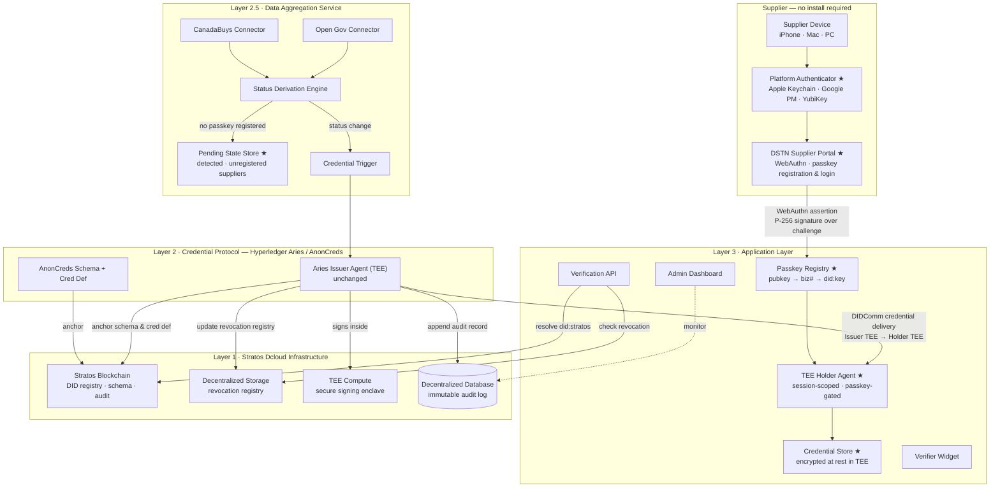
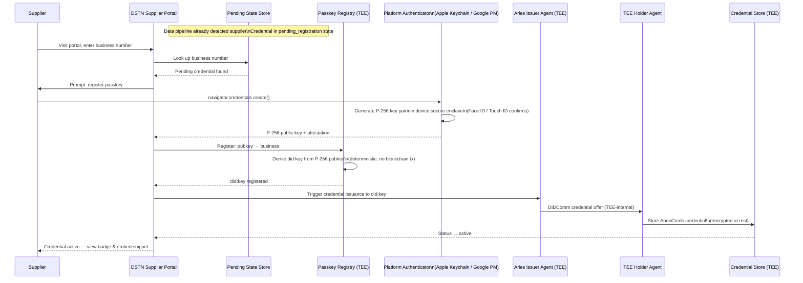
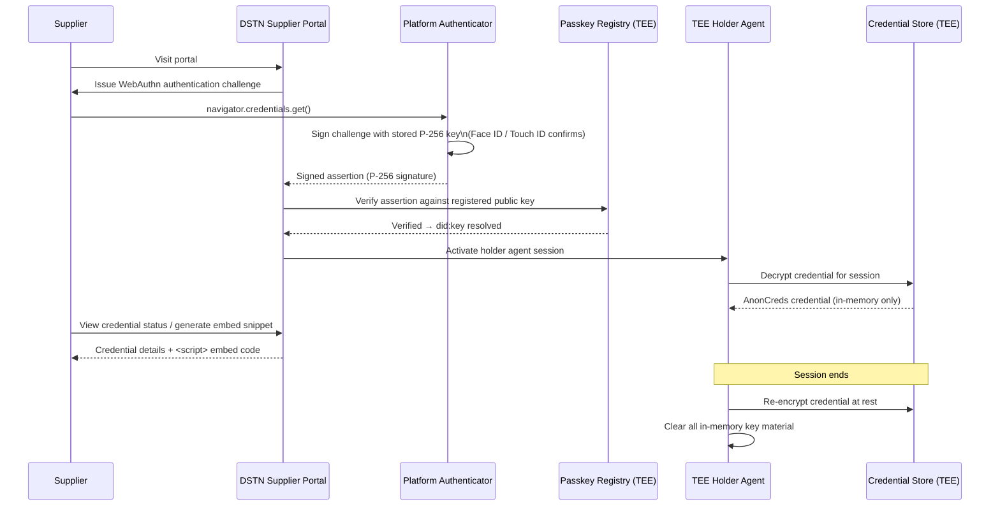

# DSTN Passkey-Gated TEE Holder — Design Spec
**Prepared by:** Stratos / DEC Foundation
**Date:** 2026-06-12
**Replaces:** Aries Holder Agent / Supplier Wallet sections of the 2026-06-11 Technical Proposal

---

## 1. Motivation

The original DSTN design requires suppliers to install an Aries wallet application, create a DID, back up a seed phrase, and manage a DIDComm connection. Digital wallet adoption among non-technical government suppliers is a known barrier — the UX friction is high and the mental model (seed phrases, wallet keys) is unfamiliar.

This spec replaces the user-installed Aries Holder Agent and Supplier Wallet with a passkey-gated, server-side TEE Holder Agent. Suppliers authenticate with their device's built-in authenticator (Apple Face ID / Touch ID, Google Passkey, Windows Hello, or a hardware key like YubiKey). No wallet software is installed. No seed phrase is managed.

**Nothing on the issuer side, verifier side, or Stratos infrastructure changes.** This is a holder-layer change only.

---

## 2. Design Decisions

| Decision | Choice | Rationale |
|---|---|---|
| Holder architecture | Passkey public key (P-256) anchors the supplier DID | Non-custodial — no server-held key. DID is a deterministic function of the passkey. |
| DID format | `did:key` derived from passkey P-256 public key | No on-chain transaction required for supplier DID registration. Stable while passkey is stable. |
| Credential storage | Server-side TEE (encrypted at rest) | Supplier can access from any device. No data lost on device change. Re-issuance is automatic anyway. |
| Onboarding (Phase 1) | Self-serve portal | Supplier visits portal, enters business number, registers passkey. No email dependency. |
| Access per company | Single designated holder (Phase 1) | One passkey per company. Multi-holder and invite flow deferred to Phase 2. |

---

## 3. Architecture

### 3.1 What Changes

| Status | Component | Note |
|---|---|---|
| **Removed** | Aries Holder Agent (user-installed) | Replaced by TEE Holder Agent |
| **Removed** | Supplier Wallet UI | Replaced by DSTN Supplier Portal |
| **Removed** | Wallet private key (user-held) | Supplier never holds a key |
| **Added** | Passkey Registry | Maps P-256 public key → business number → `did:key`. TEE-resident. |
| **Added** | TEE Holder Agent | Per-supplier Aries holder running in server TEE. Activates only during passkey-authenticated sessions. |
| **Added** | Credential Store | AnonCreds credentials encrypted at rest in TEE storage, keyed by `did:key`. |
| **Added** | DSTN Supplier Portal | Web app. WebAuthn registration and authentication. Credential view and badge snippet generator. No install. |
| **Added** | Pending State Store | Holds detected-but-unregistered suppliers until they claim their credential at the portal. Part of Data Aggregation Service. |
| **Unchanged** | Aries Issuer Agent (TEE) | AnonCreds issuance and signing — no change. |
| **Unchanged** | Stratos Blockchain | DID registry, schema anchoring, audit chain — issuer-side only. |
| **Unchanged** | Data Aggregation Service | CanadaBuys + Open Gov connectors, Status Derivation Engine, Credential Trigger — no change. |
| **Unchanged** | Verification API | Public REST endpoint. Suppliers are not involved in verification. |
| **Unchanged** | Verifier Widget | Embeddable badge. No change from supplier or verifier perspective. |
| **Unchanged** | Admin Dashboard | Internal monitoring — no change. |

### 3.2 Layer Architecture Diagram



**★ = new or changed component**

---

## 4. New Components

### 4.1 Passkey Registry
Stores the mapping between a supplier's passkey public key, their business number, and their derived `did:key`. Runs inside the Stratos TEE. The `did:key` is computed as:

```
did:key:z<multibase-encoded P-256 public key>
```

This is a deterministic, offline computation — no blockchain transaction required. The registry entry is created once at registration and updated only if the supplier re-registers with a new passkey.

### 4.2 TEE Holder Agent
A per-supplier instance of the Aries holder protocol stack, running inside the Stratos TEE. Lifecycle:

- **Dormant**: credential encrypted in Credential Store, no in-memory state
- **Active**: instantiated when a valid WebAuthn assertion is presented, session-scoped
- **Deactivated**: all in-memory key material cleared at session end, credential re-encrypted

The Holder Agent accepts DIDComm credential offers from the Aries Issuer Agent (internal, TEE-to-TEE). It does not expose a DIDComm endpoint to the public internet — the issuer and holder are co-resident in the Stratos TEE infrastructure.

### 4.3 Credential Store
AnonCreds credential objects and the AnonCreds link secret (master secret) stored per `did:key`, encrypted with a TEE-internal key. Access is **TEE-custodial**: the TEE software enforces that decryption only occurs during an active, verified passkey session — the TEE hardware isolation prevents the server operator from bypassing this policy. This is the same custody model as the Aries Issuer Agent (Innovation 2 in the Technical Proposal).

The non-custodial property of this design is the supplier's **identity DID**: the `did:key` is derived entirely from the passkey public key. The server cannot reassign or forge the supplier's DID because it does not hold the passkey private key — only the supplier's device does.

### 4.4 DSTN Supplier Portal
A standard web application (no install required). Capabilities:

| Feature | Description |
|---|---|
| Passkey registration | `navigator.credentials.create()` — generates P-256 key pair in device secure enclave |
| Passkey authentication | `navigator.credentials.get()` — signs server challenge with stored key |
| Business number lookup | Supplier enters CRA business number; portal confirms pending credential exists |
| Credential view | Status (active / pending / revoked), issue date, expiry |
| Badge snippet generator | Produces embeddable `<script>` tag for the supplier's website |

### 4.5 Pending State Store
An additional field in the Data Aggregation Service output. When the Status Derivation Engine detects a supplier whose business number has no registered passkey in the Passkey Registry, the credential trigger is not fired immediately — instead the supplier is recorded as `pending_registration`. When the supplier later registers at the portal, the portal calls the Credential Trigger to complete issuance.

---

## 5. Data Flows

### Flow 1 — Supplier Registration (New)



### Flow 2 — Supplier Session (New)



### Flows 3–5 — Unchanged

Credential display (Verifier Widget), active verification, and automated revocation flows are **unchanged** from the 2026-06-11 Technical Proposal. The supplier is not involved in any of these flows. The Verification API reads from the Stratos Blockchain and Decentralized Storage directly — no passkey, no holder agent interaction required.

---

## 6. Edge Cases

### 6.1 Device Loss / Passkey Lost
The supplier's passkey is synced by the platform (Apple Keychain syncs across all devices signed into the same Apple ID; Google Password Manager syncs across Google account devices). For single-device loss within the same ecosystem, the passkey is available on another device automatically.

If the supplier loses access to their passkey entirely (e.g., changes platforms, deletes the passkey):
1. Supplier visits the portal — authentication fails
2. Supplier initiates re-registration with a new passkey
3. A new `did:key` is derived from the new public key
4. DSTN re-issues the credential to the new `did:key` — this is automatic since issuance is data-driven
5. Old `did:key` and credential are abandoned (they carry no financial value)

Re-registration requires the supplier to prove business identity again (enter business number; the system verifies the pending/active record in the data pipeline).

### 6.2 Passkey Rotation
If a supplier's passkey is rotated by the platform (uncommon, but possible), the new public key produces a new `did:key`. The portal detects the mismatch and prompts re-registration. Same resolution path as device loss.

### 6.3 Supplier Not Yet in Public Data
If a supplier visits the portal but their business number is not yet in the CanadaBuys / Open Government datasets (i.e., their contract award has not yet appeared in the public data feed), the portal informs them that no pending credential was found and provides an estimated next sync window. No passkey is registered until a credential is available.

---

## 7. Phase 2 Considerations (Out of Scope for Phase 1)

| Feature | Description |
|---|---|
| Multi-holder per company | Multiple employees can register passkeys against the same company DID. First registrant is owner; owner can add/remove others. |
| Email invite flow | When the data pipeline detects a new supplier and a contact email is available in procurement records, DSTN proactively sends a claim invitation link. |
| Cross-platform passkey | Explicit support for cross-ecosystem passkey transfer (e.g., Apple → Android) via QR-based device linking. |
| Proof request response | Active DIDComm proof request handling — supplier explicitly authorizes a signed presentation to a specific verifier via the portal. |

---

## 8. Standards and Compliance

All standards from the 2026-06-11 Technical Proposal apply unchanged. The following additions apply to this spec:

| Standard | Application |
|---|---|
| W3C WebAuthn Level 3 | Passkey registration and authentication (`navigator.credentials.create` / `get`). P-256 (secp256r1) signature scheme. |
| FIDO2 / CTAP2 | Platform authenticator protocol (Apple Secure Enclave, Google Titan, YubiKey). |
| `did:key` method (W3C) | Supplier holder DID derived deterministically from P-256 public key. No ledger registration required. |
| TEE attestation (Intel SGX / AMD SEV) | Hardware-enforced access control policy on the Credential Store. Same guarantee as Aries Issuer Agent TEE. |

---

*End of Spec*
